<div style="text-align: center">
  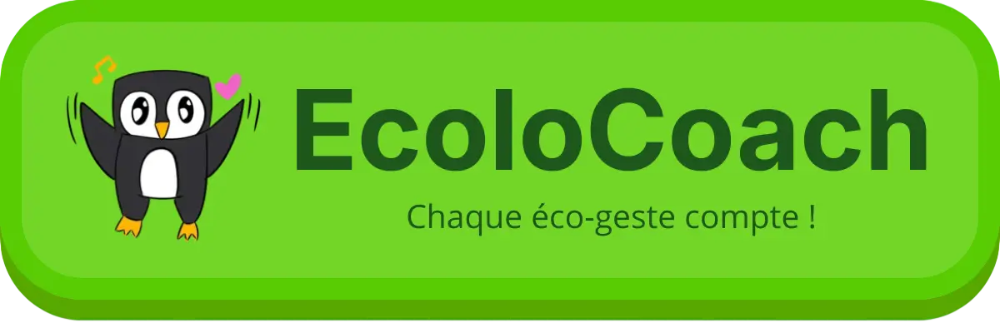

# EcoloCoach 🌿

> Une application web ludique, interactive et bienveillante, conçue pour accompagner les français dans leur transition
> écologique, sans contrainte ni culpabilité.

</div>

---

<details open>
  <summary><h2 style="display: inline-block" id="sommaire">📋 Sommaire</h2></summary>

1. [À propos du projet](#-1-à-propos-du-projet)
2. [Fonctionnalités de l'application](#-2-fonctionnalités-de-lapplication)
3. [Stack Technique](#-3-stack-technique)
4. [Architecture et Choix Techniques](#-4-architecture-et-choix-techniques)
5. [Installation et Déploiement](#-5-installation-et-déploiement)
6. [Qualité du Code, Sécurité et Accessibilité](#-6-qualité-du-code-sécurité-et-accessibilité)
7. [Auteur et Licence](#-7-auteur-et-licence)

</details>

---

## 💡 1. À propos du projet

### Contexte de développement

Ce projet a été entièrement pensé, conçu et développé dans le cadre de ma **première année de formation en tant que
Développeuse Full Stack**.

L'objectif de cet exercice était de mettre en pratique l'ensemble des compétences acquises durant l'année : de la
gestion de projet (méthodologie agile, gestion de backlog) à l'implémentation technique (frontEnd, backEnd, base de
données), tout en intégrant des notions essentielles d'**éco-conception** et d'**accessibilité**.

L'application présentée ici est un **MVP (Produit Minimum Viable)** destiné à évoluer de manière itérative.

### La Problématique

Selon l'ADEME (agence de la transition écologique), **90 % des Français** se disent préoccupés par les questions
environnementales. Pourtant, seuls **20 à 25 %** d'entre eux parviennent à adapter significativement leur mode de vie au
quotidien.

### La Solution : EcoloCoach

**EcoloCoach** a été créé pour accompagner pas à pas et sans contrainte ces français dans leur transition écologique.

En m'inspirant des mécaniques d'apprentissage ludiques et de la *gamification* (popularisées par des applications comme
Duolingo), l'application propose un accompagnement individuel. Elle décompose un grand objectif global en petites
actions quotidiennes, concrètes et mesurables.

> **Ma philosophie :** Un pilier central indispensable à la réussite de l'utilisateur basé sur **100 % d'encouragement,
0 % de culpabilisation**.

<p style="text-align: right"><a href="#sommaire">⬆️ Retour au sommaire</a></p>

---

## ✨ 2. Fonctionnalités de l'application

### 🎯 Fonctionnalités actuelles (MVP)

La version actuelle de l'application se concentre sur l'essentiel de l'expérience individuelle pour valider les bases
techniques et pédagogiques du concept :

* **Parcours d'accompagnement :** Accès à des sessions d'apprentissage composées de quiz interactifs pour assimiler les
  enjeux environnementaux de manière ludique et à son propre rythme.
* **Défis concrets du quotidien :** Proposition de challenges pratiques et réalistes (adaptés au niveau de
  l'utilisateur) pour passer facilement de la théorie à l'action.
* **Calcul et visualisation de l'impact :** Un tableau de bord personnalisé permettant à l'utilisateur de visualiser son
  empreinte carbone évitée et de mesurer l'impact positif réel de ses nouvelles habitudes via des comparaisons imagées.

### 📸 Aperçu de l'application et Parcours Utilisateur

#### 1. Le Tableau de Bord (Home In-App)

Une fois connecté, l'utilisateur accède à sa page d'accueil personnalisée construite sous la forme d'un parcours
linéaire de progression.

* **Mécanique de déblocage :** Les leçons et les défis se débloquent les uns après les autres au fur et à mesure de
  l'avancement.
* **En-tête dynamique :** Un compteur affiche en temps réel les kilogrammes de CO2 économisés.
* **Astuces :** Au milieu de la progression d'un niveau, un bloc "Astuce" contextualise les apprentissages.
* **Navigation :** Un menu burger accessible permet de naviguer rapidement entre les sections.

<div style="text-align: center">
  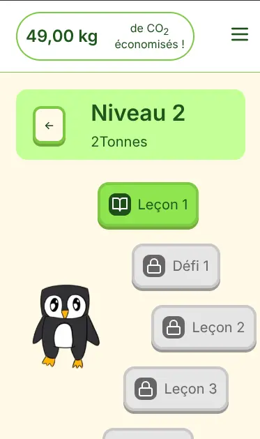
  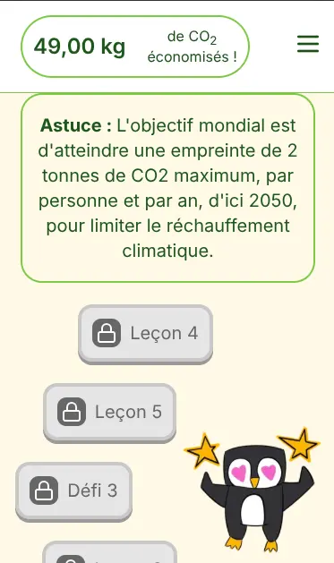
  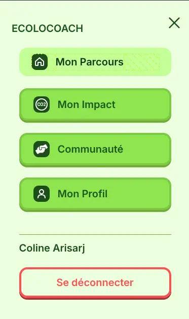
</div>

#### 2. L'Espace d'Apprentissage (Leçons)

Le cœur de la sensibilisation repose sur des modules interactifs.

* **Interface Question :** QCM épuré, surmonté d'une barre de progression visuelle.
* **Interface Réponse & Pédagogie :** Bandeau de feedback avec explication détaillée et sourcée, permettant d'ancrer les
  savoirs de manière positive.

<div style="text-align: center">
  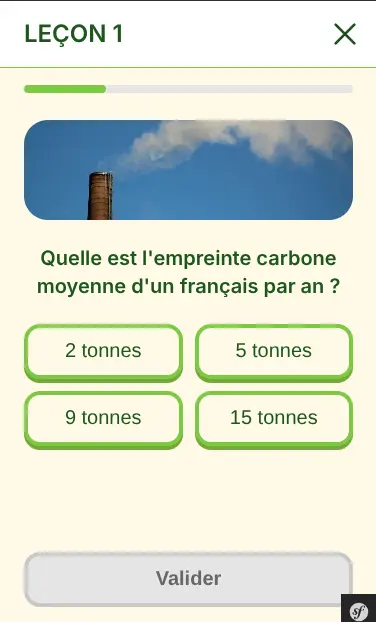
  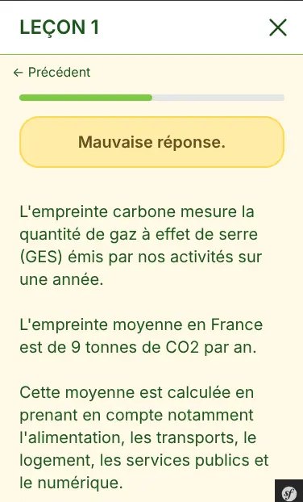
</div>

#### 3. Les Défis du Quotidien

Passer de la théorie à la pratique se fait via des défis clairs et engageantes.

* **Consultation d'un défi :** Affiche la thématique, le niveau d'impact et l'estimation des économies de CO2.
* **Flexibilité totale :** L'utilisateur peut **Accepter** ou **Refuser** le défi. Les défis refusés peuvent être
  acceptés
  ultérieurement.

<div style="text-align: center">
  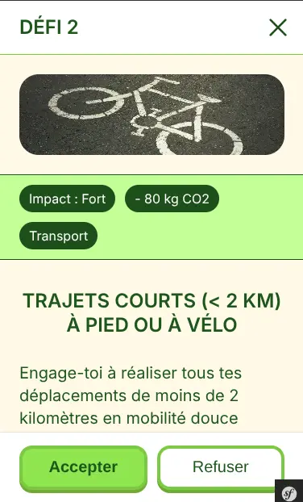
</div>

#### 4. Suivi de l'Impact & Éco-comparateur

La page d'impact permet de valoriser concrètement les efforts fournis par l'utilisateur.

* **Visualisation imagée :** Comparaison concrète basée sur les données du **comparateur officiel de l'ADEME**.
* **Gestion des challenges :** Récapitulatif des défis acceptés. Possibilité de les déclarer **Validés** ou de les *
  *Quitter**.

<div style="text-align: center">
  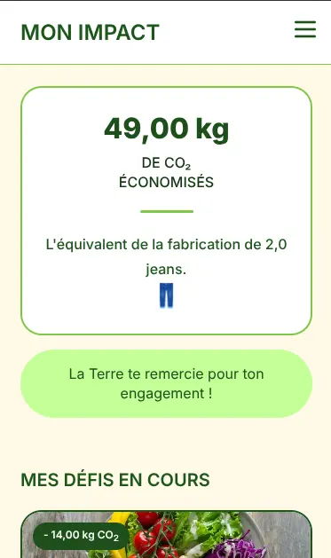
  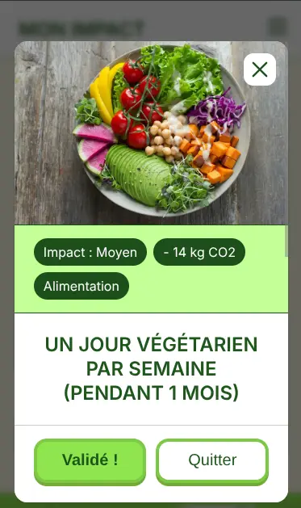
</div>

### 🚀 Feuille de route (Roadmap)

L'application a vocation à s'enrichir prochainement de fonctionnalités axées sur le collectif :

* **L'Écologie en équipe (Social & Gamification) :** Connexion avec des amis, défis collectifs, impact écologique global
  de l’équipe.
* **Parcours sur-mesure (Quiz d'orientation) :** Évaluation initiale pour orienter l'utilisateur vers le parcours le
  plus adapté.

<div style="text-align: center">
  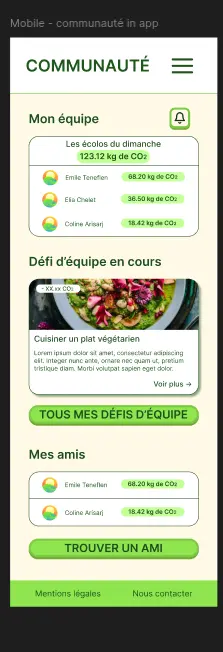
</div>

### 🔮 Vision à long terme (Périmètre futur)

* **Onboarding :** Guide interactif à la première connexion.
* **Gamification poussée :** Vue globale des niveaux, avancée rapide, challenges dynamiques.
* **Social :** Système de parrainage.
* **Espace Administration :** Création et mise à jour des parcours directement depuis l'interface.
* **Géolocalisation :** Carte interactive des points de tri et commerces écoresponsables.

<p style="text-align: right"><a href="#sommaire">⬆️ Retour au sommaire</a></p>

---

## 🛠️ 3. Stack Technique

### Backend

| Technologie                                                                                                                                   |  Version   | Utilisation                 |
|:----------------------------------------------------------------------------------------------------------------------------------------------|:----------:|:----------------------------|
| [](https://symfony.com)                 | `5.17 CLI` | Framework PHP full-stack    |
| [](https://www.php.net)                             |   `8.5`    | Langage backend             |
| [](https://www.doctrine-project.org) |   `2.4`    | ORM pour abstraction BDD    |
| [](https://getcomposer.org)          |   `2.9`    | Gestionnaire de dépendances |

### Frontend

| Technologie                                                                                                                                                             | Utilisation                          |
|:------------------------------------------------------------------------------------------------------------------------------------------------------------------------|:-------------------------------------|
| [](https://twig.symfony.com)                                               | Moteur de templates sécurisé         |
| [](https://developer.mozilla.org/fr/docs/Web/CSS)                          | Variables, Grid, Flexbox, Responsive |
| [](https://developer.mozilla.org/fr/docs/Web/JavaScript) | Async/Await, Modal                   |

### Base de Données & Infrastructure

| Technologie                                                                                                                               | Justification                                   |
|:------------------------------------------------------------------------------------------------------------------------------------------|:------------------------------------------------|
| [](https://www.sqlite.org)             | SGBD relationnel léger, idéal pour un MVP.      |
| [](https://www.alwaysdata.com) | Solution PaaS française optimisée pour Symfony. |

<p style="text-align: right"><a href="#sommaire">⬆️ Retour au sommaire</a></p>

---

## 🏗️ 4. Architecture et Choix Techniques

### Le Modèle MVC (Architecture Actuelle)

L'application repose sur le modèle **MVC (Modèle-Vue-Contrôleur)** natif de Symfony. Ce choix d'architecture
monolithique a permis de centraliser la logique métier et de maximiser la rapidité de développement :

* **Modèle :** ORM Doctrine (Entités PHP et requêtes SQLite optimisées).
* **Vue :** Moteur Twig (génération HTML côté serveur).
* **Contrôleur :** Interception des requêtes HTTP et orchestration des services.

### 🌱 Éco-conception & Numérique Responsable (Green IT)

L'impact environnemental du numérique a été placé au centre des arbitrages techniques.

* **Hébergement localisé :** Les serveurs *Alwaysdata* sont situés en **France**, limitant le routage réseau et
  favorisant un mix énergétique bas-carbone.
* **Sobriété du code et des assets :**
    * Limitation aux fonctionnalités essentielles.
    * Utilisation exclusive du format standard **WebP** pour les visuels.
    * CSS et JavaScript natifs épurés.
    * Cohérence visuelle Mobile/Desktop pour limiter les lignes de code.

<div style="text-align: center">
  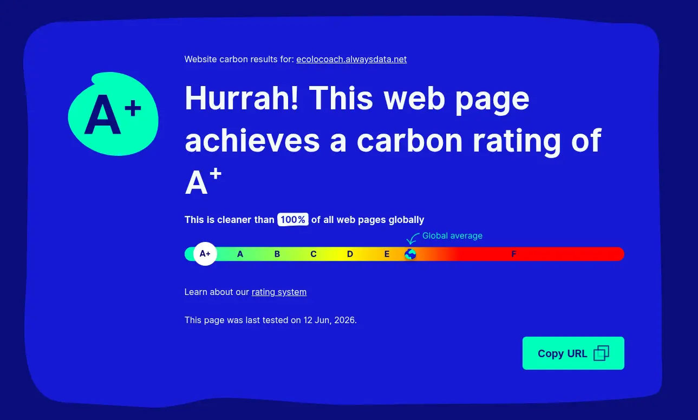
</div>

<p style="text-align: right"><a href="#sommaire">⬆️ Retour au sommaire</a></p>

---

## 🚀 5. Installation et Déploiement

### 🌍 Accès à l'application en ligne

👉 **[Découvrir EcoloCoach en direct](https://ecolocoach.alwaysdata.net/)**

### 💻 Installation en local (Mode Développeur)

Grâce à Symfony AssetMapper et SQLite, le projet se lance en moins de 5 minutes.

**Prérequis :**

* PHP : Version 8.4 ou supérieure
* Composer : Version 2.*

```bash
# 1. Cloner le dépôt et se rendre dans le dossier
git clone https://github.com/CDasse/ecolocoach_project.git
cd ecolocoach_project

# 2. Installer les dépendances PHP
composer install

# 3. Créer et configurer automatiquement le fichier d'environnement
cat << 'EOF' > .env.local
APP_ENV=dev
APP_SECRET=un_secret_local_au_choix_32_caracteres
DATABASE_URL="sqlite:///%kernel.project_dir%/var/data.db"
EOF

# 4. Initialiser la base de données SQLite et les assets
mkdir -p var
php bin/console doctrine:database:create --if-not-exists
php bin/console doctrine:migrations:migrate -n
php bin/console doctrine:fixtures:load -n
php bin/console importmap:install

# 5. Lancer le serveur local
symfony server:start -d
```

L'application sera accessible sur http://127.0.0.1:8000.

### ⚙️ Intégration et Déploiement Continus (CI/CD)

[](https://github.com/CDasse/ecolocoach_project/actions/workflows/tests.yml)
[](https://github.com/CDasse/ecolocoach_project/actions/workflows/green-it-analysis.yml)
[](https://github.com/CDasse/ecolocoach_project/actions/workflows/sonar-analysis.yml)
[](https://github.com/CDasse/ecolocoach_project/actions/workflows/build-artefact-and-deploy.yml)

L'application s'appuie sur une suite de 4 workflows GitHub Actions configurés en pipeline "cascade" :

```plaintext
[ Push / PR Main ]
│
▼
1. Tests Automatiques (Unitaires, E2E & accessibilité)
   │ ▼ (si succès)
2. Analyse Éco-conception (Green IT Ecoindex >= 85)
   │ ▼ (si succès)
3. Quality Gate & Sécurité (SonarCloud Scan)
   │ ▼ (si succès)
4. Build de Production & Déploiement (Alwaysdata)
```

---

## 🛡️ 6. Qualité du Code, Sécurité et Accessibilité

### 🦊 La "Quality Gate" SonarCloud

Le projet utilise SonarCloud pour l'analyse statique du code.

[](https://sonarcloud.io/summary/new_code?id=ecolocoach)
[](https://sonarcloud.io/summary/new_code?id=ecolocoach)
[](https://sonarcloud.io/summary/new_code?id=ecolocoach)

[](https://sonarcloud.io/summary/new_code?id=ecolocoach)
[](https://sonarcloud.io/summary/new_code?id=ecolocoach)
[](https://sonarcloud.io/summary/new_code?id=ecolocoach)
[](https://sonarcloud.io/summary/new_code?id=ecolocoach)

[](https://sonarcloud.io/summary/new_code?id=ecolocoach)
[](https://sonarcloud.io/summary/new_code?id=ecolocoach)
[](https://sonarcloud.io/summary/new_code?id=ecolocoach)

Pour lancer les tests localement (unitaires, E2E, accessibilité) avec réinitialisation de la BDD :

```bash
mpn run test
```

> Un script bash a été rédigé afin d'implémenter la base de données fictive (via le fichier de fixtures)
> avant et après les tests.

### ⚡ Performances & Expérience Utilisateur

L'application atteint l'excellence sur les rapports Google Lighthouse :

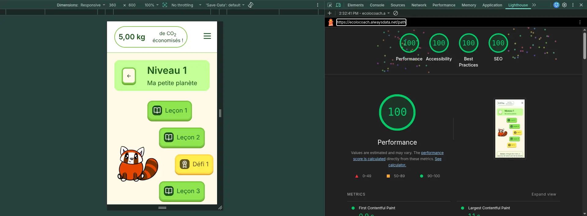

💡 Rétrospective d'optimisation : Si c'était à refaire aujourd'hui, je m'orienterais vers une architecture de type SPA (
Vue.js ou React couplé à une API Symfony). Cela limiterait les rechargements serveurs, offrant de meilleures
performances pour les utilisateurs en connexion réduite (3G), rejoignant ainsi ma démarche Green IT.

### 🔒 Sécurité & Durcissement de l'Infrastructure

* Serveur de Déploiement : La clé SSH utilisée par GitHub Actions est restreinte à une seule commande (deploy.sh),
  empêchant toute navigation serveur en cas de compromission.

* Sécurité Réseau (Mozilla Observatory - 110/100) :

    * CSP : Restriction des sources d'exécution des scripts (protection XSS).
    * HSTS : Redirection forcée et stricte en HTTPS.
    * Headers : Protections natives contre le vol de cookies et le Clickjacking.

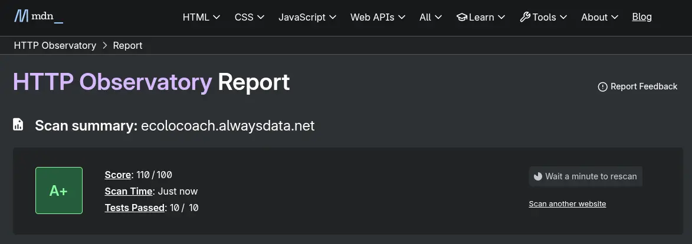

### 👁️ Accessibilité & Inclusion

Conçue pour être accessible au plus grand nombre (normes WCAG et RGAA) :

* Contrastes : Ratio de contraste minimal de 4.5:1 (WCAG AA).

* Navigation & Sémantique : Interface 100% navigable au clavier (Tab) et structure HTML5 stricte (balises sémantiques,
  attributs ARIA, textes alternatifs) pour les lecteurs d'écran.

--- 

## 👥 7. Auteur et Licence

### Auteur

Ce projet a été réalisé avec passion et rigueur dans le cadre de ma formation de Développeuse Full Stack. Si vous
souhaitez échanger sur l'architecture du projet, l'éco-conception, ou discuter d'opportunités professionnelles,
n'hésitez pas à me contacter !

GitHub : @CDasse

LinkedIn : [Lien vers mon Profil LinkedIn](https://www.linkedin.com/in/cl%C3%A9mence-dass%C3%A9-47a85a38b/)

### Licence

Ce projet est mis à disposition sous la licence MIT.
